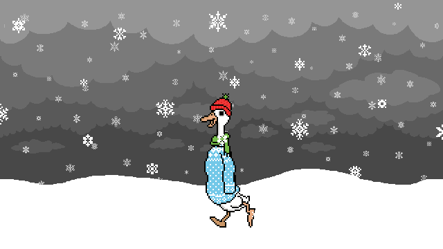

# Привет! 👋 Я panickyCat

Я — любительница котиков и яркого кода.  
Пишу на **Java** (да-да — *«джапБа»* 😺) и создаю красивые проекты с UI и анимациями.

---

# ✨ Навыки

---

# 🐱 Люблю котиков

   

Котята вдохновляют меня на чистый и аккуратный код — и на анимации интерфейсов!

---

# 🚀 Проекты

  

⇒ Хочешь посмотреть проекты — загляни в мои pinned-репозитории!

---

# 📈 Статистика

---

# 💬 О себе
- 🎓 Учусь и практикуюсь в Java
- 🔭 Сейчас работаю над анимированным UI в JavaFX
- 🌱 Люблю экспериментировать с визуалом и микровзаимодействиями

---

# 📫 Контакты
- GitHub: [panickyCat](https://github.com/panickyCat)
- Готова к сотрудничеству и новым идеям — пишите issues или PR 😊

---

*Если хочешь — могу сделать альтернативную версию: ещё ярче (неон), в пастельных тонах, или минималистично — скажи, какая нравится больше!*
